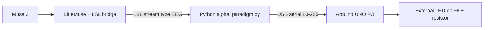

# Technokinesis (EEG → LED)

Prototype that streams **Muse 2** EEG over **LSL**, computes a simple band-based metric in **Python**, and drives an **Arduino UNO R3** LED with **USB serial**—including **PWM dimming** between two thresholds.

> **Scope:** learning / demo project, not a medical device. Muse + consumer EEG are noisy; thresholds need tuning per session.

---

## What it demonstrates

- Real-time **LSL** ingestion (`pylsl`)
- Lightweight **frequency-band features** (delta / theta / alpha / beta) from short windows
- **Threshold + hysteresis** for a binary “on” state, plus **continuous activation** for brightness
- **Perceptual brightness:** gamma-shaped mapping before 8-bit PWM (eyes are ~logarithmic)
- Optional **live plot** (`matplotlib`) for debugging thresholds

---

## Architecture



---

## Hardware

| Item | Notes |
|------|--------|
| **Muse 2** | Worn correctly; stable contact helps a lot |
| **PC (Windows)** | Runs BlueMuse + Python |
| **Arduino UNO R3** | e.g. RexQualis kit |
| **LED + resistor** | e.g. 220 Ω–1 kΩ in series |
| **USB cable** | Data-capable (not charge-only) |

**Wiring (PWM dimming):**

- `~9` → resistor → LED **anode** (long leg)
- LED **cathode** (short leg) → `GND`

Upload `arduino_serial_led/arduino_serial_led.ino`. It listens for lines like `L128\n` (brightness 0–255) at **115200 baud**. Pin 13 onboard LED still responds to `1` / `0` if you use binary mode elsewhere.

---

## Software setup

1. **Clone** this repo.
2. **Python 3.10+** recommended (you used 3.14 in places; match your machine).
3. Create and activate a venv, then install deps:

```powershell
cd path\to\EEG_Telekinesis
python -m venv .venv
.\.venv\Scripts\Activate.ps1
python -m pip install -r requirements.txt
```

4. Start **BlueMuse** and your **LSL EEG stream** before running the script.

---

## How to run

Replace `COM3` with your Arduino port (Device Manager / Arduino IDE).

**Focus-style metric (example), dimming + optional live graph:**

```powershell
python alpha_paradigm.py --serial-port COM3 --mode focus --metric beta_minus_alpha --thresh-on -0.22 --thresh-off -0.35 --dimming --dashboard --metric-smoothing 0.25 --activation-smoothing 0.12 --max-brightness-step 2 --brightness-gamma 2.6
```

**Logging only (no Arduino):**

```powershell
python alpha_paradigm.py
```

**Close Arduino Serial Monitor** before running Python (one program owns the COM port).

CSV files go under `paradigm_logs/` (ignored by git by default).

---

## Tuning thresholds (practical)

1. Run **without** Arduino once and watch `alpha_metric` in the console or CSV.
2. Pick **`thresh_off`** and **`thresh_on`** so your “relaxed” vs “focused” (or your chosen task) sit on opposite sides most of the time.
3. Use **`--metric-smoothing`** and **`--activation-smoothing`** to reduce flicker.
4. Use **`--brightness-gamma`** (~2–3) so low PWM steps look smoother to the eye.
5. Expect **day-to-day drift**—re-tune after headset refit or fatigue.

---

## Repo layout

```
EEG_Telekinesis/
├── alpha_paradigm.py       # LSL → metric → CSV; optional serial + dashboard
├── requirements.txt
├── arduino_serial_led/
│   └── arduino_serial_led.ino
├── Reading_data.py         # older / alternate recording experiment stub
└── README.md
```

---

## Portfolio tips (optional)

- Add **`docs/`** with 1 wiring photo + 1 screenshot of the live plot or a **short demo GIF/video** (host on GitHub or link YouTube).
- In README, embed: `` once the file exists.

---

## License

No license file is included yet. If you want employers to reuse code easily, add an **`MIT`** `LICENSE` file in the repo root.
